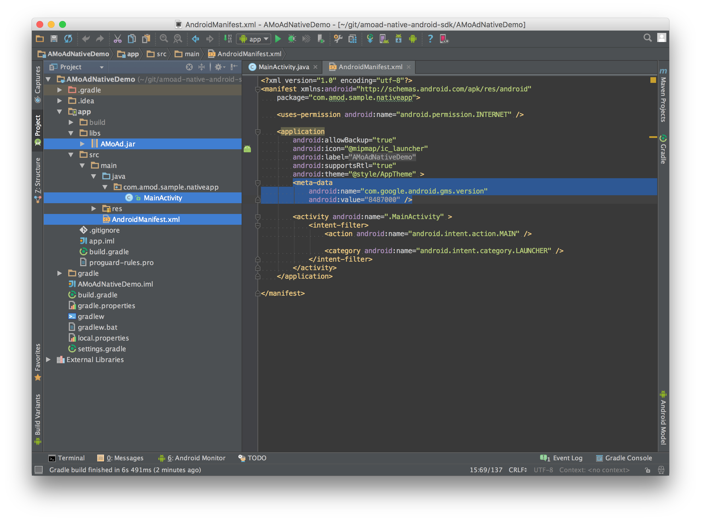

<div align="center">

</div>

# AMoAd Native Demo for Android


## Introduction

ネイティブ広告のスタイルを管理画面よりHTML+CSSでデザインできます（HTMLコードの画面キャプチャは例です。実際にはアプリのデザインに合わせたコードを書きます）。

## Requirements

Android 2.3 or later

## Installing

[ZIPをダウンロード](https://github.com/amoad/amoad-native-android-sdk/archive/master.zip)

## Usage

管理画面から取得したsidをMainActivity.javaのSIDに設定する。tagは複数の広告を区別するための任意文字列です。

```java
// TODO [SDK] 管理画面から取得したsidを入力してください
private static final String SID1 = "62056d310111552c000000000000000000000000000000000000000000000000";
private static final String TAG1 = "Ad01";
```

## API

[AMoAd Native API](https://cdn.rawgit.com/amoad/amoad-native-android-sdk/master/docs/javadoc/index.html)

## Project Settings

1. AndroidStudioで「../AMoAdNativeDemo/」をFile>Openする。

2. AndroidプロジェックトでGooglePlayerServiceを設定する。
   ([GooglePlayerService設定方法](https://developers.google.com/android/guides/setup#add_google_play_services_to_your_project))

