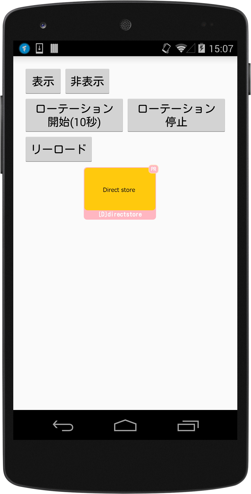

<div align="center">

</div>

# AMoAd Native Demo for Android




## Introduction

ネイティブ広告のスタイルを管理画面よりHTML+CSSでデザインできます。

## Requirements

Android 2.3 or later

## Installing

[ZIPをダウンロード](https://github.com/amoad/amoad-native-android-sdk/archive/master.zip) *mavenに対応予定*

## Usage

管理画面から取得したsidをMainActivity.javaのSIDに設定する。tagは複数の広告を区別するための任意文字列です。

```java
// TODO [SDK] 管理画面から取得したsidを入力してください
private static final String SID1 = "62056d310111552c000000000000000000000000000000000000000000000000";
private static final String TAG1 = "Ad01";
```

## API

[AMoAd Native API](https://rawgit.com/amoad/amoad-native-android-sdk/master/docs/javadoc/index.html)
